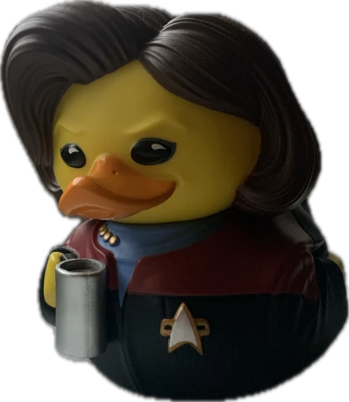

# Hi, I'm Ari!

I have a background in philosophy and a passion for coding.

## About me
- 🌃Living in Leipzig -> moving to Bremen soon
- ✨I studied at Coding Bootcamps Europe (09/2023 - 07/2024) and have been self-studying since 2021.
- 💞Favorites: 🌱Plants, 🚀Science-Fiction, 🐈Cats&Dogs🐕‍🦺, 🖊️Drawing & Junk Journaling, 👾Gaming

## Tech Stack

## Currently Exploring

## 📫 Get in Touch 
 - <arisenger0@gmail.com>
 - [Discord](https://www.discordapp.com/users/.piepmatz) 
  

<!--
**Artromi/Artromi** is a ✨ _special_ ✨ repository because its `README.md` (this file) appears on your GitHub profile.

Here are some ideas to get you started:

- 🔭 I’m currently working on ...
- 🌱 I’m currently learning ...
- 👯 I’m looking to collaborate on ...
- 🤔 I’m looking for help with ...
- 💬 Ask me about ...
- 📫 How to reach me: ...
- 😄 Pronouns: ...
- ⚡ Fun fact: ...
-->

